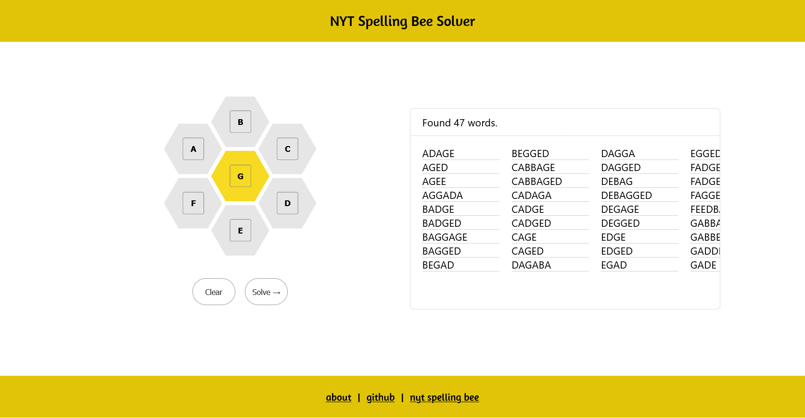

<!-- ABOUT THE PROJECT -->

## About The Project



A simple web application that can be used as a reference guide for the [New York Times Spelling Bee](https://www.nytimes.com/puzzles/spelling-bee) game. In the game itself, valid words are hand-curated, so this solver will likely generate a superset of answers that contain words not accepted by the game. The solver uses an-array-of-english-words as a solution domain.

To use the solver, simply fill all the hive cells with letters. Then hit 'solve' to generate a list of words that use only those letters, and contain at least one instance of the center letter.

### Built With

- [![React][React.js]][React-url]

### Installation

1. Clone the repo
   ```sh
   git clone https://github.com/roryhofland/nyt-games-solver
   ```
2. Install NPM packages
   ```sh
   npm install
   ```
3. Run locally
   ```sh
   npm start
   ```

<!-- MARKDOWN LINKS & IMAGES -->
<!-- https://www.markdownguide.org/basic-syntax/#reference-style-links -->

[React.js]: https://img.shields.io/badge/React-20232A?style=for-the-badge&logo=react&logoColor=61DAFB
[React-url]: https://reactjs.org/
